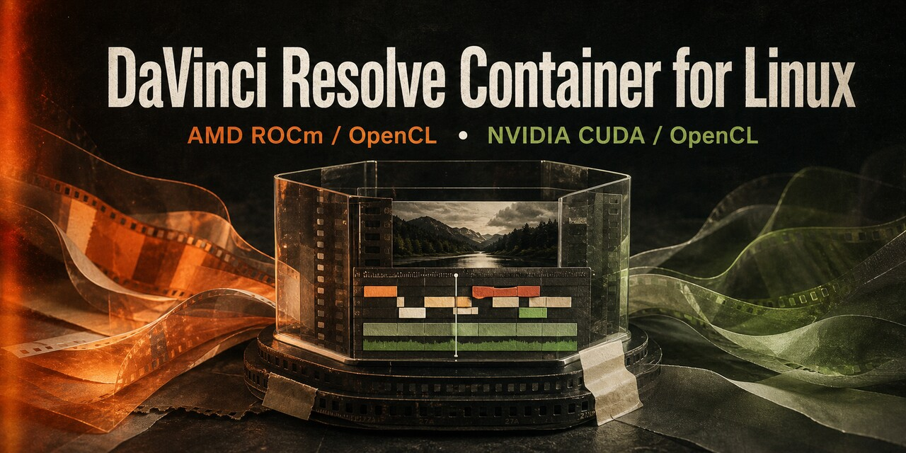

<h1 align="center">DaVinci Resolve Container for Linux</h1>

<p align="center">
  
</p>

<h2 align="center">
  <a href="docs/INSTALL.md">Installation Guide — Start Here</a>
</h2>

<p align="center">
  <strong>Ubuntu · Debian · Fedora · Arch Linux · AMD · NVIDIA</strong>
</p>

Run **DaVinci Resolve Studio or Free 21.0.4** on Ubuntu, Fedora, Arch Linux,
Kubuntu, and other Linux desktops using a Docker-backed Distrobox container.
The setup supports **AMD ROCm/OpenCL** and **NVIDIA CUDA/OpenCL** GPUs without
replacing the graphics drivers on your host.

> [!IMPORTANT]
> This is an unofficial community project. It does not include or redistribute
> DaVinci Resolve. Resolve remains subject to Blackmagic Design's license and
> must come from an official Blackmagic Design download.

## Why Use This?

- One command installs, configures, verifies, and launches Resolve.
- The Fedora container supplies the Linux libraries Resolve expects while your
  GPU driver stays on the host.
- AMD and NVIDIA use separate containers and settings directories.
- Resolve settings and project-library state are isolated from your normal home.
- A verifier checks the GPU, OpenCL/CUDA, audio, shared memory, and missing
  libraries before you start troubleshooting Resolve itself.
- The Studio installer can be downloaded automatically; the Free edition uses
  the official ZIP you download after registration.

## Current Support

| Component          | Status                                                                |
| ------------------ | --------------------------------------------------------------------- |
| DaVinci Resolve    | Studio and Free 21.0.4 build 5                                        |
| AMD                | ROCm/OpenCL; tested with Radeon RX 7900 XT on X11                     |
| NVIDIA             | CUDA and OpenCL via NVIDIA Container Toolkit; hardware testing wanted |
| Host distributions | Ubuntu/Debian, Fedora, Arch, and related distributions                |
| Container          | Docker-backed Distrobox using Fedora 39                               |
| Desktop session    | Xorg/X11 tested; Wayland may work but is not yet validated            |

Blackmagic Design's Linux requirements still apply, including a supported
discrete GPU and sufficient RAM/VRAM. The installation guide covers complete
distro-specific host, AMD ROCm/OpenCL, and NVIDIA Container Toolkit setup.

## Quick Start

Install Docker, Distrobox, `clinfo`, `curl`, and `unzip`, and make sure your GPU
works on the host. Then:

```bash
git clone https://github.com/Distortions81/DaVinci-Resolve-Container.git
cd DaVinci-Resolve-Container
./quickstart.sh
```

The default is Resolve Studio with automatic GPU selection. On a machine with
both AMD and NVIDIA GPUs, AMD is selected first; choose NVIDIA explicitly with:

```bash
RESOLVE_GPU=nvidia ./quickstart.sh
```

The Free edition requires registration and a manual download from the
[Blackmagic Design support page](https://www.blackmagicdesign.com/support/family/davinci-resolve-and-fusion).
Leave the ZIP in `~/Downloads`, then run:

```bash
RESOLVE_EDITION=Resolve ./quickstart.sh
```

You can also provide its exact location:

```bash
RESOLVE_EDITION=Resolve \
RESOLVE_ZIP="$HOME/Downloads/DaVinci_Resolve_21.0.4_Linux.zip" \
./quickstart.sh
```

Launch Resolve later from the application menu or terminal:

```bash
davinci-resolve-docker
```

For NVIDIA on a mixed-GPU host:

```bash
RESOLVE_GPU=nvidia davinci-resolve-docker
```

## Before Running Setup

Confirm the selected GPU works on the host.

AMD:

```bash
ls -l /dev/kfd /dev/dri/renderD*
clinfo | grep -E 'Platform Name|Device Name|Device Vendor|Device Type'
```

NVIDIA:

```bash
nvidia-smi
docker info --format '{{json .Runtimes}}'
```

The NVIDIA runtime output must contain `nvidia`. If these checks fail, follow
the [host and GPU installation guide](docs/INSTALL.md) first.

## Verify the Installation

```bash
./scripts/verify-resolve.sh
```

For NVIDIA on a mixed-GPU host:

```bash
RESOLVE_GPU=nvidia ./scripts/verify-resolve.sh
```

The verifier checks container configuration, GPU access, AMD OpenCL or NVIDIA
CUDA/OpenCL, audio, `/dev/shm`, Resolve's libraries, and isolated state paths.

## Common Commands

| Goal                      | Command                               |
| ------------------------- | ------------------------------------- |
| Install and launch        | `./quickstart.sh`                     |
| Set up without launching  | `./scripts/setup-resolve.sh`          |
| Use NVIDIA explicitly     | `RESOLVE_GPU=nvidia ./quickstart.sh`  |
| Verify the installation   | `./scripts/verify-resolve.sh`         |
| Reset Resolve's GPU cache | `./scripts/reset-gpu-cache.sh`        |
| Check project databases   | `./scripts/check-resolve-dbs.sh`      |
| Test without audio        | `davinci-resolve-docker --audio=null` |

## How It Is Isolated

| Backend | Container                  | Resolve settings and project state                  |
| ------- | -------------------------- | --------------------------------------------------- |
| AMD     | `davincibox-docker`        | `~/.local/share/davinci-resolve-21-box-home`        |
| NVIDIA  | `davincibox-nvidia-docker` | `~/.local/share/davinci-resolve-21-nvidia-box-home` |

Resolve itself is installed at `/opt/resolve`. Removing a container does not
remove the isolated settings or project state.

## Documentation

- [Installation and GPU setup](docs/INSTALL.md)
- [Troubleshooting and maintenance](docs/TROUBLESHOOTING.md)
- [Advanced options and project-library guidance](docs/ADVANCED.md)
- [Contributing and useful bug reports](CONTRIBUTING.md)

## FAQ

### Does DaVinci Resolve work on Ubuntu or Fedora?

This project supplies the Fedora userspace Resolve needs inside a container, so
the host can be Ubuntu, Fedora, Arch, or a related Linux distribution. The GPU
driver and Docker still run on the host.

### Does it support AMD GPUs?

Yes. The tested path passes `/dev/kfd` and `/dev/dri` into the container and
points its OpenCL loader at the host AMD ROCm/OpenCL library.

### Does it support NVIDIA CUDA?

Yes, experimentally. NVIDIA Container Toolkit injects CUDA, OpenCL, OpenGL,
Vulkan, display, and video driver capabilities. NVIDIA hardware validation and
bug reports are especially welcome.

### Why use a container instead of installing Resolve directly?

Resolve expects a specific Linux userspace. The container keeps those runtime
libraries separate from your desktop distribution while retaining GPU, audio,
display, media, and project access.

### Does this download or bypass a Resolve license?

No. Studio still requires a valid activation key, dongle, or Blackmagic Cloud
license. The Free edition still requires the official registration download.

## Contributing and Support

If setup fails, run the verifier and include its output in a
[bug report](https://github.com/Distortions81/DaVinci-Resolve-Container/issues/new/choose).
Please also include the host distribution, desktop session, GPU model, driver,
Resolve edition, and whether the problem appeared during setup or launch.

Pull requests and hardware test reports are welcome. See
[CONTRIBUTING.md](CONTRIBUTING.md) before submitting changes.

DaVinci Resolve is a trademark of Blackmagic Design Pty. Ltd. This project is
not affiliated with or endorsed by Blackmagic Design.
